# Practical 
<details>
 <summary>Project Structure</summary>
 
- src/include/ - Contains header files (*.vh) with necessary macros or parameter definitions.
- src/module/ - Contains Verilog files for each module in the SoC design.
- output/ - Directory where compiled outputs and simulation files will be generated.

## Setup and Prepare Project Directory
Clone or set up the directory structure as follow:
```txt
VSDBabySoC/
├── src/
│   ├── include/
│   │   ├── sandpiper.vh
│   │   └── other header files...
│   ├── module/
│   │   ├── vsdbabysoc.v      # Top-level module integrating all components
│   │   ├── rvmyth.v          # RISC-V core module
│   │   ├── avsdpll.v         # PLL module
│   │   ├── avsddac.v         # DAC module
│   │   └── testbench.v       # Testbench for simulation
└── output/
└── compiled_tlv/         # Holds compiled intermediate files if needed
```
To clone the directory follow the commands
```
git clone https://github.com/manili/VSDBabySoC.git
```
By cloning the [Git](https://github.com/manili/VSDBabySoC.git) we get the structure as mentioned above.


## TLV to Verilog Conversion for RVMYTH
Initially we see that there is only rvmyth.tlv file inside src/module. To check that follow the commands below.
```
cd VSDBabySoC/src/module/
ls
```
We see only .tlv file which means the RVMYTH core is written in TL-Verilog.

To convert it into a .v file for simulation, follow the steps below:
```
# Step 1: Install python3-venv
sudo apt update
sudo apt install python3-venv python3-pip

# Step 2: Create and activate a virtual environment
cd /sky2syn_week_2/VSDBabySoC/
python3 -m venv sp_env
source sp_env/bin/activate

# Step 3: Install SandPiper-SaaS inside the virtual environment
pip install pyyaml click sandpiper-saas

# Step 4: Convert rvmyth.tlv to Verilog
sandpiper-saas -i ./src/module/*.tlv -o rvmyth.v --bestsv --noline -p verilog --outdir ./src/module/

```
 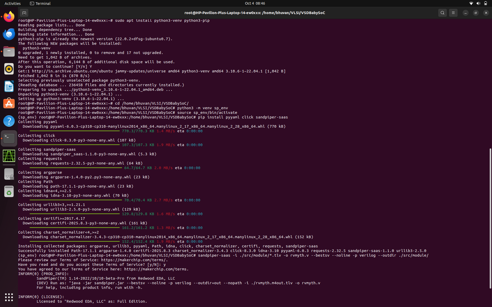
  
The rvmyth.v file has been generagted to check them follow the commands:
```
cd VSDBabySoC/src/module/
ls
```
Now we can see .v file

### Note

To use this environment in future sessions, always activate it first:
```
source sp_env/bin/activate
```
To diactivate:
```
diactivate
```
</details>
<details>
 <summary>Simulation</summary>
<details>
 <summary>Pre-Synthesis Simulation</summary>
 
Run the following command to perform a pre-synthesis simulation:
```
cd VSDBabySoC/
mkdir -p output/pre_synth_sim
cd
iverilog -o /home/bhuvan/Bhuvan/sky2syn_week_2/Practicals/VSDBabySoC/output/pre_synth_sim/pre_synth_sim.out -DPRE_SYNTH_SIM -I /home/bhuvan/Bhuvan/sky2syn_week_2/Practicals/VSDBabySoC/src/include -I /home/bhuvan/Bhuvan/sky2syn_week_2/Practicals/VSDBabySoC/src/module /home/bhuvan/Bhuvan/sky2syn_week_2/Practicals/VSDBabySoC/src/module/testbench.v
```
Then run the below commands for generating .vdc to check the gtkwave and observe the waveform:
```
cd VSDBabySoC/output/pre_synth_sim
./pre_synth_sim.out
gtkwave pre_synth_sim.vcd
```
Drag and drop the CLK, reset, OUT (DAC), and RV TO DAC [9:0] signals to their respective locations in the simulation tool
 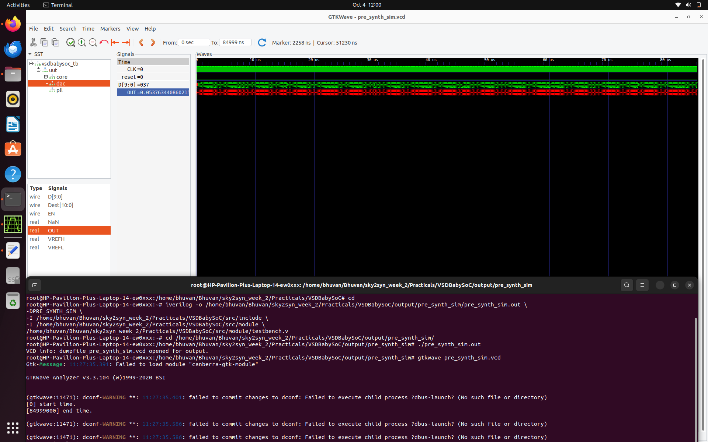
 In this picture we can see the following signals:

CLK: This is the input CLK signal of the RVMYTH core. This signal comes from the PLL, originally.

reset: This is the input reset signal of the RVMYTH core. This signal comes from an external source, originally.


RV_TO_DAC[9:0]: This is the 10-bit output [9:0] OUT port of the RVMYTH core. This port comes from the RVMYTH register #17, originally.

OUT: This is a real datatype wire which can simulate analog values. It is the output wire real OUT signal of the DAC module. This signal comes from the DAC, originally.

This can be viewed by changing the Data Format of the signal to Analog --> Step by right clicking on OUT and then Analog --> Step

 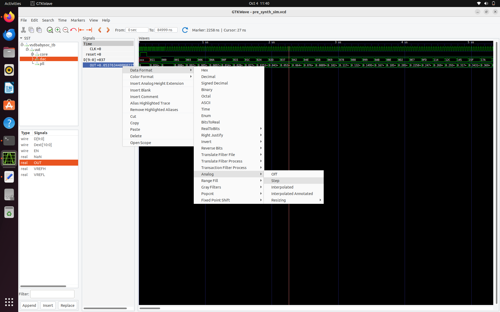
 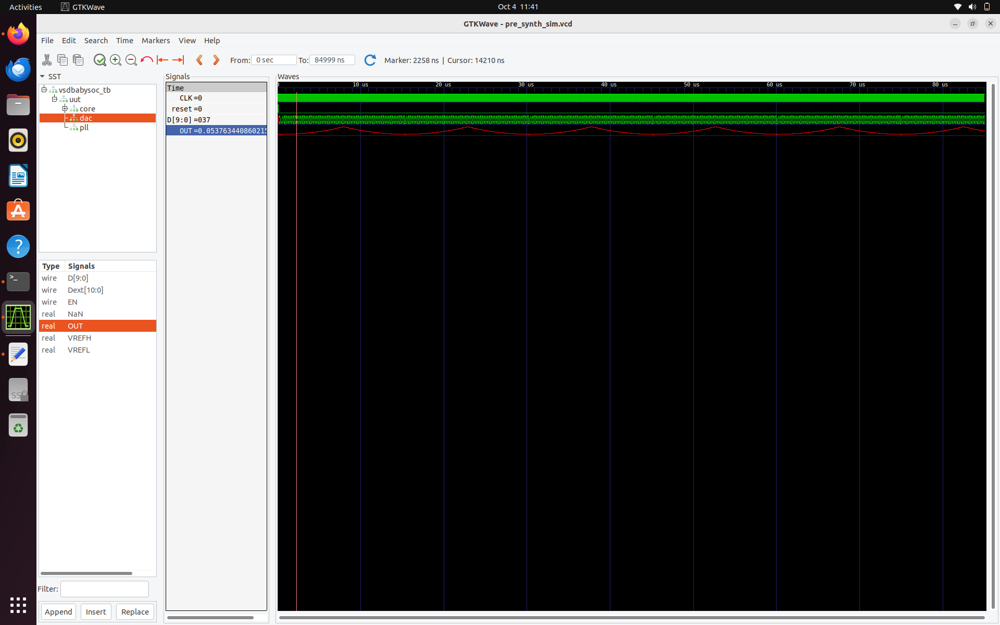
 </details>
<details>
 <summary>Post-Synthesis Simulation</summary>

Run the following command to perform a pre-synthesis simulation step by step:
## Step 1: Load the Top-Level Design and Supporting Modules


The following cp commands copy essential header files from the src/include directory into the working directory. These include:

sp_verilog.vh – contains Verilog definitions and macros

sandpiper.vh – holds integration-related definitions for SandPiper

sandpiper_gen.vh – may include auto-generated or tool-generated parameters

The commands are:
```
cp -r src/include/sp_verilog.vh .
cp -r src/include/sandpiper.vh .
cp -r src/include/sandpiper_gen.vh .
ls # this provides the directory required
images  LICENSE  Makefile  output  README.md  sandpiper_gen.vh  sandpiper.vh  sp_env  sp_verilog.vh  src
# Launch the yosys synthesis tool from your working directory.
# Change the directory to where you want to initialise the yosys
yosys
#Read the rvmyth.v file with the include path using -I option.
read_verilog -I src/include/ src/module/rvmyth.v
```

 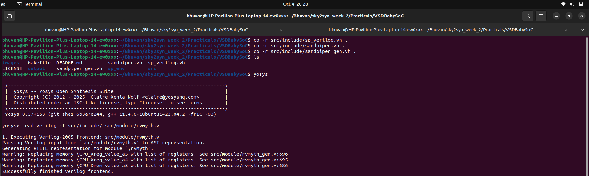

### Note
If you try to read the rvmyth.v file using yosys without copying the necessary header files first, you may encounter errors. To avoid errors, make sure to copy the required include files into your working directory! This ensures Yosys can resolve them correctly during parsing, even if the -I option is used.


Read the clk_gate.v file with the include path using -I option.
```
yosys> read_verilog -I src/include/ src/module/clk_gate.v
```
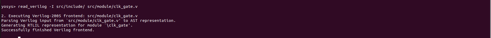

## Step 2: Load the Liberty Files for Synthesis
Now load the liberary into for synthesis
```
yosys> read_liberty -lib src/lib/avsdpll.lib 
yosys> read_liberty -lib src/lib/avsddac.lib 
yosys> read_liberty -lib src/lib/sky130_fd_sc_hd__tt_025C_1v80.lib
```

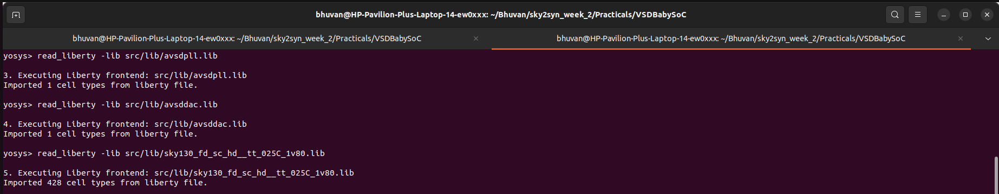

## Step 3: Run Synthesis Targeting vsdbabysoc by Reading the main vsdbabysoc.v RTL file into the yosys environment.


```
# Read the main vsdbabysoc.v RTL file into the yosys environment.
yosys> read_verilog src/module/vsdbabysoc.v 
# Now run the synthesis top module
yosys> synth -top vsdbabysoc
```

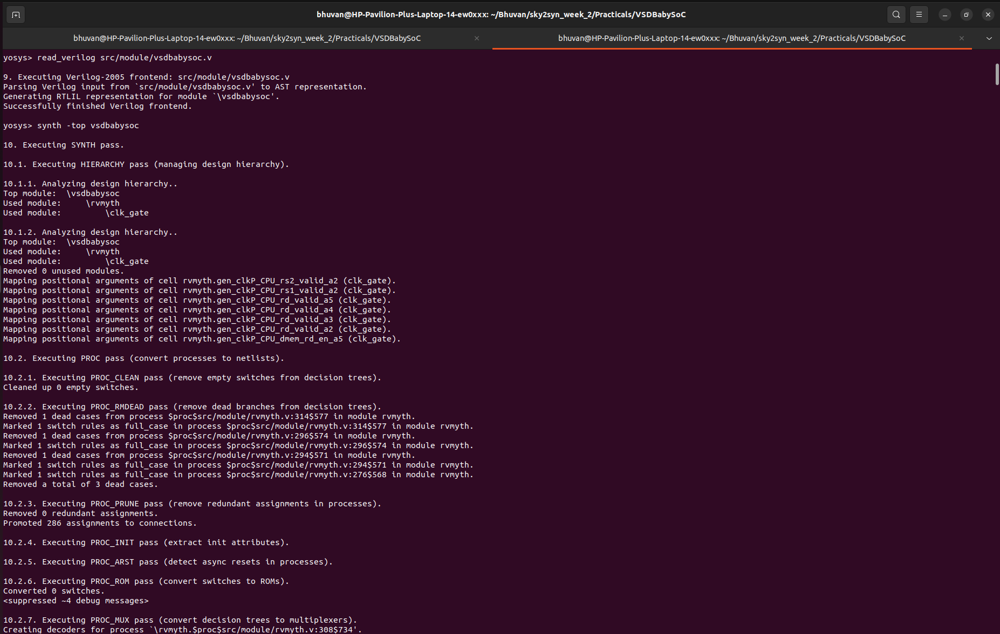
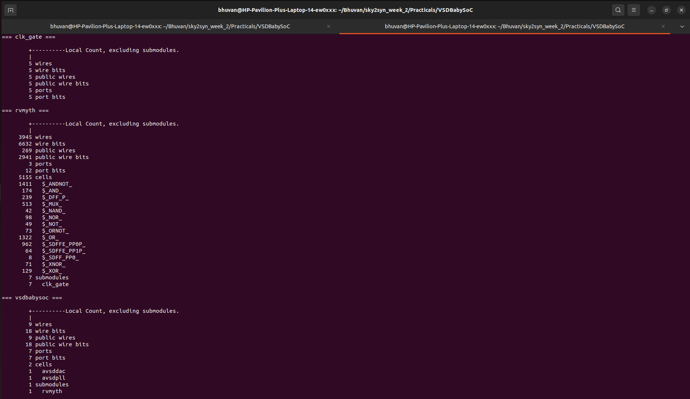
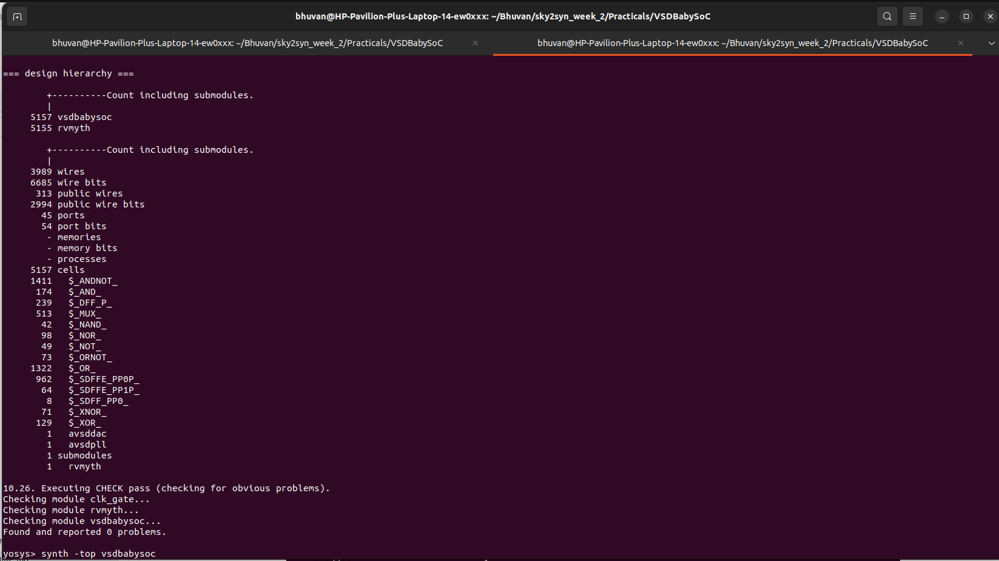


## Step 4: Map D Flip-Flops to Standard Cells

```
yosys> dfflibmap -liberty src/lib/sky130_fd_sc_hd__tt_025C_1v80.lib
```
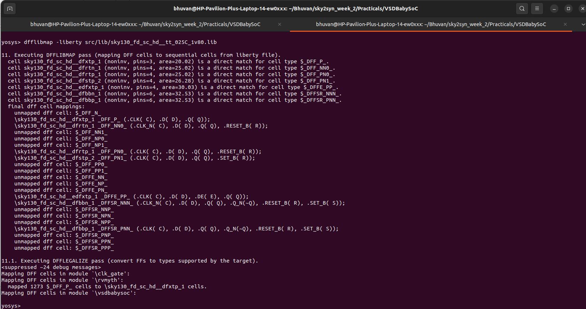

## Step 5: Perform Optimization and Technology Mapping

```
yosys> opt
yosys> abc -liberty src/lib/sky130_fd_sc_hd__tt_025C_1v80.lib -script +strash;scorr;ifraig;retime;{D};strash;dch,-f;map,-M,1,{D}

 ---------------------------------------------------------------------------------------
| Step           | Purpose                                                              |
|--------------- | ---------------------------------------------------------------------|
| `strash`       | Structural hashing (reduces logic redundancy)                        |
| `scorr`        | Sequential sweeping for redundancy removal                           |
| `ifraig`       | Incremental FRAIGing (logic equivalence checking and optimization)   |
| `retime;{D}`   | Move registers across combinational logic to optimize timing         |
| `strash`       | Re-run structural hashing after retiming                             |
| `dch,-f`       | Delay-aware combinational optimization with fast mode                |
| `map,-M,1,{D}` | Map logic to gates minimizing area (`-M,1`) and retime-aware (`{D}`) |
 ---------------------------------------------------------------------------------------
```

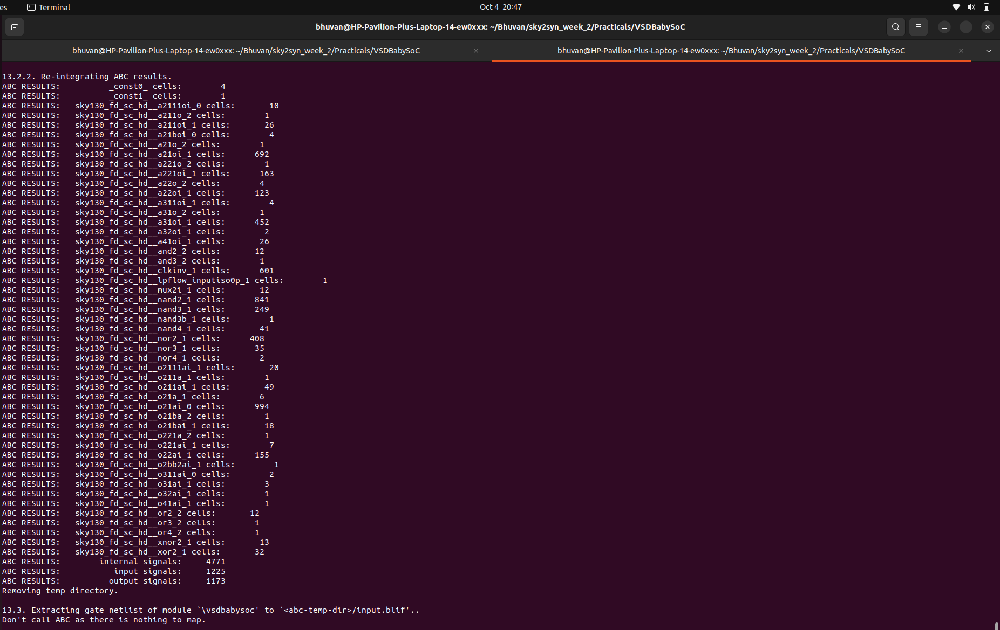

## Step 6: Perform Final Clean-Up and Renaming

```
yosys> flatten
yosys> setundef -zero
yosys> clean -purge
yosys> rename -enumerate

 --------------------------------------------------------------------------------------------------------------
| **Command**         | **Purpose / Usage**                                                                    |
|-------------------- | ---------------------------------------------------------------------------------------|
| `flatten`           | Flattens the entire design hierarchy into a single-level netlist.                      |
| `setundef -zero`    | Replaces all undefined (`x`) logic values with logical `0` to avoid simulation issues. |
| `clean -purge`      | Removes all unused wires, cells, and modules; `-purge` makes it more aggressive.       |
| `rename -enumerate` | Renames internal wires and cells to unique, numbered names for consistency.            |
 --------------------------------------------------------------------------------------------------------------
```
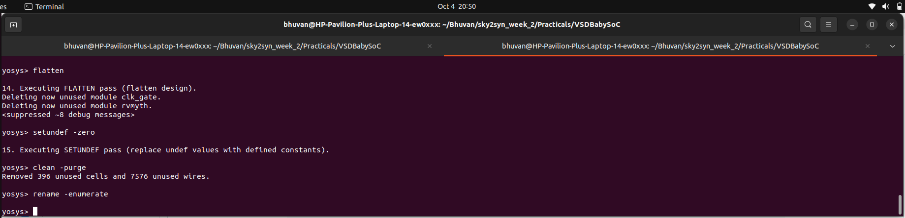

## Step 7: Check Statistics
```
yosys> stat
```
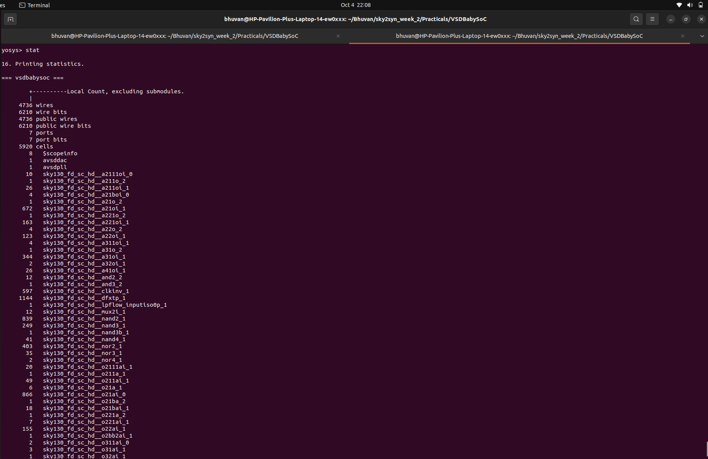
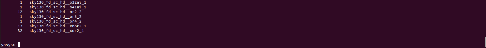


## Step 8: Write the Synthesized Netlist
```
yosys> write_verilog -noattr output/post_synth_sim/vsdbabysoc.synth.v
```

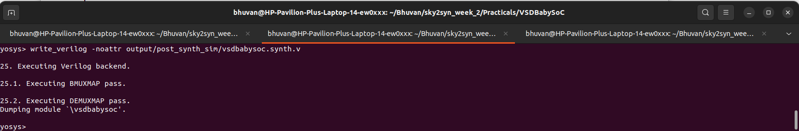


4
